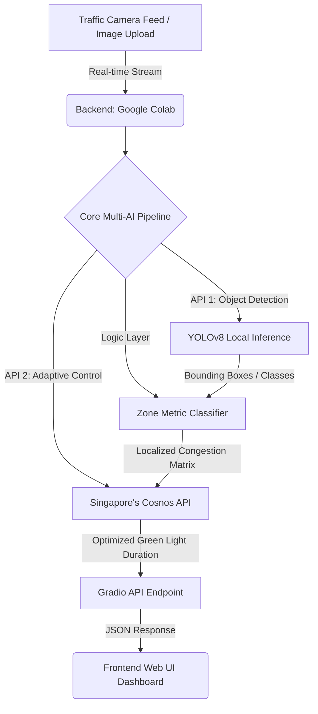

# TDNHackathon Project - 3rd Prize Winner

A rapid AI integration project developed in 6 hours for TDNHackathon, deploying global AI models via Google Colab, Claude, and Canva.

## Project Links and Demos
* Technical AI Demo: [Open Google Colab Notebook](https://colab.research.google.com/drive/1NH51SPexjWIF4Pr_QvDn9EYejZL0ueIo?usp=sharing)
* Web UI and system prototype: [Open Web Demo Link](https://smartsignaloutlier.netlify.app)
   * Reviewer Account - Email: `smartsignal@outliers.com` | Password: `smartsignal#123`
* Presentation and Pitch Deck: [View Canva Presentation](https://canva.link/s37759dz893h8yu)
## Quick Start & Demo Instructions
Because the computer vision model requires backend computing resources to process traffic camera feeds in real-time, the AI engine must be initialized before using the Web UI.

**Step 1: Initialize the AI Backend (Google Colab)**
1. Open the **Technical AI Demo** (Google Colab Notebook) linked above.
2. Click `Runtime` > `Run all` (or press `Ctrl + F9`) to install dependencies and start the YOLOv8 model.
3. Scroll to the bottom of the notebook and wait for a public `gradio.live` URL to be generated. You can test the AI logic directly via this link.

**Step 2: Experience the Web UI**
1. Once the backend is running, open the **Web UI and System Prototype** link.
2. Log in using the reviewer account provided above: 
   * **Email:** `smartsignal@outliers.com`
   * **Password:** `smartsignal#123`
3. 3. Make sure you reload the page or click f5 to reload. Then, navigate directly to tab **"Hệ Thống AI"** (AI System) on the navigation bar to experience the integrated dashboard.
4. **Testing Tip:** You can download a sample traffic image, upload the image to the web, and click Phân tích ảnh and Tính đèn xanh. Now, explore it seemlessly.
## API-Driven System Architecture & Pipeline

## API Integration & Spatial Metrics

1. **Computer Vision Layer (YOLOv8):** Runs local inference to detect and classify heterogeneous vehicle streams, returning bounding box coordinates and object classes.
2. **Zone Metric Matrix (Spatial Classifier):** 
   - A custom logic layer that divides the intersection grid into distinct, weighted spatial zones (e.g., Queue Zone, Buffer Zone).
   - Maps the bounding box coordinates into these specific matrices to calculate localized spatial density, moving beyond generic vehicle counting.
3. **Adaptive Control (Cosnos API):** Ingests the computed Zone Metric Matrix via API calls to dynamically calculate and return optimized green light durations ($T_{green}$).
4. **Asynchronous State Sync:** Pipelines the computed parameters from the Colab backend to the Frontend UI via Gradio endpoints with minimal latency.

## Project Overview and Methodology
* Time Constraint: Built, tested, and finalized the prototype within a strict 6-hour limit under hackathon pressure.
* Core Approach: Instead of training machine learning models from scratch, the team focused on integrating global AI models using prompt engineering, workflow logic, and rapid prototyping.
* System Workflow:
    * Google Colab: Developed the technical demo and backend logic.
    * Claude (Interface): Deployed as the conversational AI prototype.
    * Claude (Synthesis): Utilized to compile data and refine system logic.
    * Canva: Used to structure the project results and create the final pitch.

## Tech Stack and Tools
* AI Foundation: Anthropic Claude, Python AI ecosystem, Antigravity ADE, AI studio
* Development Environment: Google Colab
* Design and Presentation: Canva
## Hackathon Constraints & Future Roadmap

* **API-First Strategy:** Given the strict 6-hour limit, we strategically adopted an API-first approach—orchestrating pre-trained models and global APIs rather than training from scratch. This allowed us to deliver a fully functional, end-to-end prototype on time.
* **Modular Scalability:** The pipeline is intentionally decoupled. The current API backbones can be seamlessly upgraded to customized, locally-trained models optimized specifically for mixed traffic environments without breaking the core architecture.

## Core Team & Contribution Breakdown

* **Nguyen Dang Minh** | *Team Leader & Lead AI System Architect*
  * **Responsibilities:** Spearheaded overall project development; engineered the core API-driven AI pipeline (YOLOv8 deployment, camera feed processing, and spatial logic integration); architected the post-hackathon system integration to unify the web UI and simulation modules into a single framework.
  
* **Nguyen Viet Hung** | *Lead Web UI/UX Engineer*
  * **Responsibilities:** Designed and engineered the main interactive web dashboard; developed custom feature modules and integrated live external APIs for real-time weather and road surface analytics.

* **Tran Huu Tho** | *Simulation & Analytics Engineer*
  * **Responsibilities:** Designed and developed the independent traffic congestion simulation module, establishing mathematical matrices to analyze vehicle density versus velocity vector fields.

* **Du My Nghi** | *Research & Presentation Specialist*
  * **Responsibilities:** Conducted deep-dive background research on localized traffic datasets; structured core analytical findings and co-authored the final pitch deck.

* **Nguyen Le Mai Anh** | *Research & Documentation Specialist*
  * **Responsibilities:** Researched global smart city integration frameworks; compiled system technical documentation and co-authored the final pitch deck.

## Project Gallery & Proof of Concept
*Check out our [Project Assets Folder](./assets) to view live demo screenshots, zone mapping visuals, team photos, and award certificates from the 6-hour sprint.*
